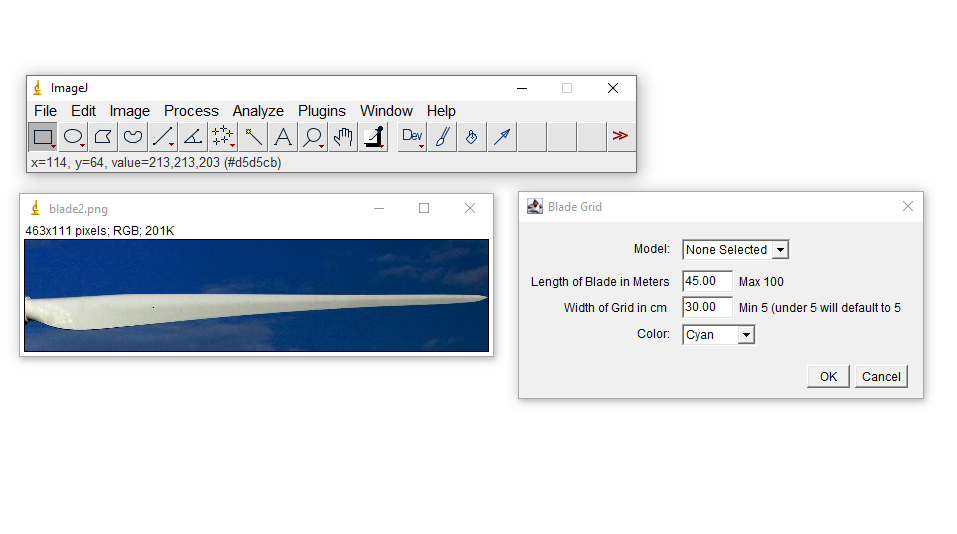
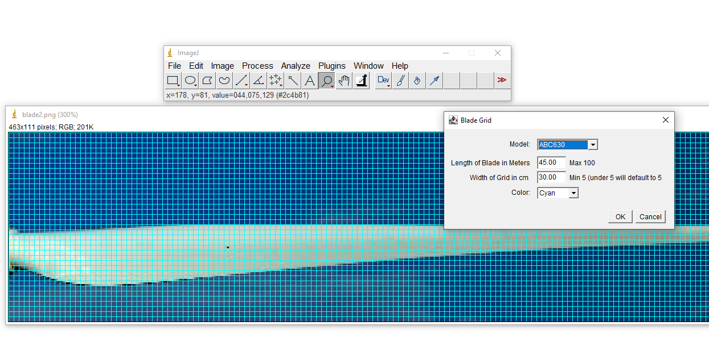

# Wind Turbine Blade Grid Plugin for ImageJ

## Purpose
This ImageJ plugin was created in 2016–2017 for a client who inspected wind turbine blades in the field. The client would photograph damage on turbine blades and send the images to engineers for assessment and to track progression of defects over time.

The client needed a reliable way to add a measurement grid to these photos so that damage size (in cm) could be accurately judged.

## How it works
1. The user first crops the image so that the blade occupies (roughly) the full length or height of the photo.
2. The plugin assumes the largest dimension of the cropped image equals the real-world blade length.
3. It then overlays a configurable grid (in centimetres) across the entire image.

Blade length can be supplied in two ways:
- Automatically – the plugin queries a small database of wind turbine models and retrieves the official rotor blade length.
- Manually – the user simply types in the correct length of the turbine model if it is not in the database or if they prefer to override it.

## Technical notes
- Written in Java as an ImageJ 1.x plugin (pre-ImageJ2 era).
- Last updated around 2017.
- Depends on an older ImageJ API and Java version.

## Current status – **Unmaintained / Probably broken**
ImageJ (now Fiji/ImageJ2) and Java have both evolved significantly since this plugin was written. I would be genuinely surprised if it installs and runs without modification on modern installations.

I am publishing the source code anyway because someone might find the concept or parts of the implementation useful.

Feel free to fork, fix, modernise, or cannibalise any part of it. No warranty of any kind is provided — use at your own risk.

## Screenshots

